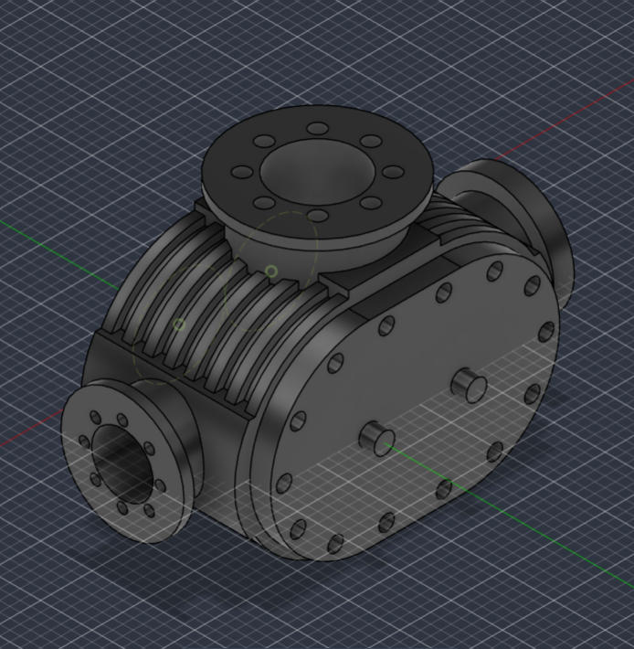
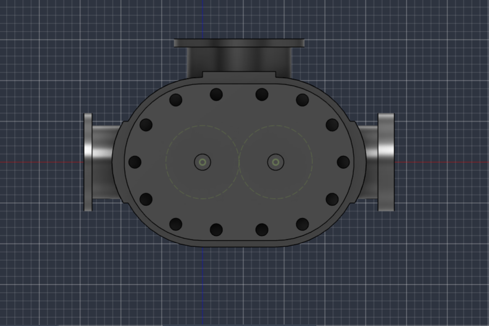
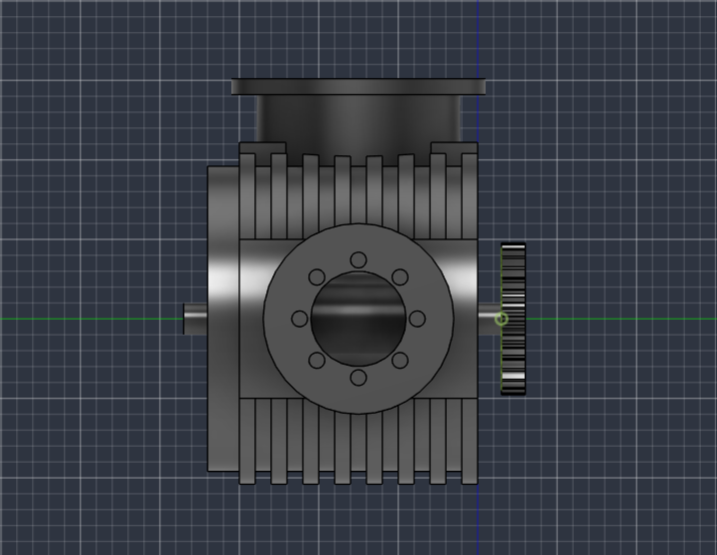

# Syed Rizvi | Engineering Portfolio

Engineering projects, CAD models, drawings, and technical work.

## About Me

I am an engineering-focused student at the University of Houston with an interest in mechanical design, CAD, manufacturing, and problem-solving. I am currently building my technical experience through engineering coursework and hands-on projects.

## Technical Skills

- Autodesk Fusion 360
- 3D CAD Modeling
- Microsoft Excel
- Engineering Design
  
## Projects

### Blower Compressor
**Autodesk Fusion 360**

#### Additional Views

| Front View | Right-Side View |
|---|---|
|  |  |

#### Project Overview
Created a detailed 3D model of a mechanical blower compressor in Autodesk Fusion 360. The model incorporates a multi-part housing, mounting flanges, fastener locations, cooling fins, and other mechanical features to reproduce the geometry of a real-world mechanical assembly.

#### CAD Skills Demonstrated
- Parametric 3D modeling
- Sketching and dimensional constraints
- Extrusions and revolved features
- Circular patterns and repeated geometry
- Fillets and detailed mechanical features
- Multi-component mechanical modeling

#### What I Learned
This project strengthened my ability to translate mechanical geometry into a structured 3D CAD model and showed me how individual features and components come together to form a more complex mechanical system.

#### Project Files
- [Download Fusion 360 Model](BlowerCompressor.f3d)
